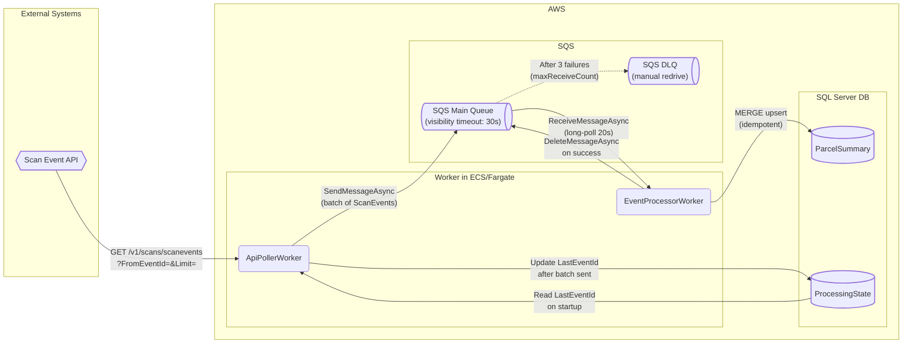

# ScanEventWorker

A .NET 10 worker service that continuously polls a scan event API, queues events through Amazon SQS, and persists parcel summary data to SQL Server.

Built for the Freightways take-home exercise.

## Architecture



**Two decoupled `BackgroundService` workers:**

- **`ApiPollerWorker`** - Reads `LastEventId` from `ProcessingState` on startup, polls the API in batches, sends valid events to SQS, and advances `LastEventId` after each successful batch. Resumes from the last processed event on restart.
- **`EventProcessorWorker`** - Long-polls SQS, MERGEs each event into `ParcelSummary`, then deletes the message. On failure the message is not deleted - SQS redelivers after the visibility timeout and moves it to the DLQ after 3 attempts.

## Prerequisites

- [mise](https://mise.jdx.dev/getting-started.html)
  - manages .NET 10, pkl, and hk
- [Docker](https://www.docker.com/)
  - SQL Server (Azure Edge SQL for aarch64) + LocalStack

## Quick Start

See **[docs/local-setup.md](docs/local-setup.md)** for the full setup walkthrough. In brief:

```shell
mise i                         # Install .NET 10, pkl, hk
mise run test                  # Run tests with 80% coverage gate
mise run build                 # Debug build
mise run publish               # Native AOT binary
docker-compose up -d           # Start SQL Server + LocalStack
dotnet user-secrets set "ScanEventApi:BaseUrl" "https://your-api-host" --project src/ScanEventWorker
dotnet run --project src/ScanEventWorker/ScanEventWorker.csproj
```

## Assumptions

0. Scan Event API pre-exists and and _all_ events are retained at _all_ times indefinitely.
1. ~~Events are returned ordered by `EventId` ascending~~
2. ~~`EventId` is monotonically increasing - querying `FromEventId=X` reliably returns all events with ID ≥ X~~
3. ~~The API returns an empty `ScanEvents` array when no more events exist (end-of-feed signal)~~
   - guarded: `ApiPollerWorker` checks `Count == 0` and backs off
4. ~~Only one worker instance runs at a time~~
   - enforced: startup `Mutex` in `Program.cs` aborts a second instance
5. `RunId` comes from the nested `User.RunId` field in the JSON response
   - guarded: `null` coalesces to `string.Empty`
6. `StatusCode` may be an empty string
   - guarded: `null` coalesces to `string.Empty`
7. ~~`PickedUpAtUtc` and `DeliveredAtUtc` are set on the **first** occurrence of their respective event types and are never overwritten~~
   - enforced: `??=` in `ParcelSummary` + `IS NULL` in SQL MERGE
8. ~~Unknown `Type` values are stored as-is in `ParcelSummary` without setting pickup/delivery timestamps~~
   - enforced: `switch` default + SQL `CASE`
9. `CreatedDateTimeUtc` is the timestamp recorded as `PickedUpAtUtc`/`DeliveredAtUtc`
   - the spec sample contains a `CreatedDateTimeUtc` field on each event
   - no separate pickup/delivery timestamp field is defined
10. First PICKUP/DELIVERY occurrence sets the timestamp permanently
    - the spec is silent on correction or reversal events
    - enforced: `??=` in `ParcelSummary` + `IS NULL` guard in SQL MERGE
11. `Device` fields (`DeviceId`, `DeviceType`) and `User.UserId`/`User.CarrierId` from the API response are not persisted
    - the spec only defines `ParcelSummary` columns
    - extra fields are silently ignored
12. `STATUS` events update the most-recent-event columns (`LatestType`, `LatestStatusCode`, etc.) but do not affect `PickedUpAtUtc`/`DeliveredAtUtc`
13. Polling uses `FromEventId=LastEventId` (inclusive) rather than `LastEventId+1`
    - the last processed event is re-fetched on every cycle to avoid missing events if IDs have gaps
    - the idempotent MERGE absorbs the duplicate without side effects
14. The event feed starts at `EventId=1`
    - `ProcessingState` is seeded with `LastEventId=1` on first run

## Known Limitations

1. Event retention
   - The worker assumes the API retains all events indefinitely (Assumption 0)
   - If the API enforces a rolling retention window (e.g. 7 days), downtime longer than that window causes permanent data loss with no recovery path.
2. No API authentication/authorisation
   - `ScanEventApiClient` sends unauth HTTP requests. The spec sample shows no auth header
   - if the production API requires one, it must be added before deployment
3. No horizontal scaling-up/out
   - `ProcessingState` is a single-row table and the startup `Mutex` enforces one poller instance
   - Scaling the poller requires distributed locking and a different cursor model
4. All quiet on the DLQ front
   - Messages that fail 3 times move to the DLQ and die there
   - Without monitoring they accumulate undetected

## Potential Improvements

- [ ] **Health checks**: expose `/healthz` endpoint[^1] reporting queue depth and DB connectivity
- [ ] **Metrics**: OpenTelemetry counters for events processed/sec, SQS queue depth, DLQ size
- [ ] **Horizontal scaling**: run multiple `EventProcessorWorker` instances; SQS competing-consumer model handles this without coordination
- [ ] **DLQ visibility**: persist DLQ messages to a `FailedEvents` DB table for operational queries
- [ ] **Rate limiting**: token bucket on the API poller to avoid hammering the upstream service
- [ ] **Database migrations**: replace the `IF NOT EXISTS` initialiser with FluentMigrator for versioned schema changes
- [ ] **Production database**: RDS SQL Server (managed via CDK stack) instead of Docker for managed backups and HA

[^1]: `/healthz` endpoint is [actually deprecated](https://kubernetes.io/docs/reference/using-api/health-checks/#api-endpoints-for-health) since Kubernetes v1.16, and the more specific `/livez` and `/readyz` endpoints are preferred.

## Detailed Documentations

- [Local Setup](docs/local-setup.md)
  - Docker
  - Azure Edge SQL database
  - credentials, and run steps
- [Infrastructure](docs/infrastructure.md)
  - CDK stack
  - downstream fan-out architecture
  - spec constraint: why polling exists, and the event-driven alternative
- [Design Rationale](docs/design-rationale.md)
  - Domain model
  - error handling
  - AOT decisions
