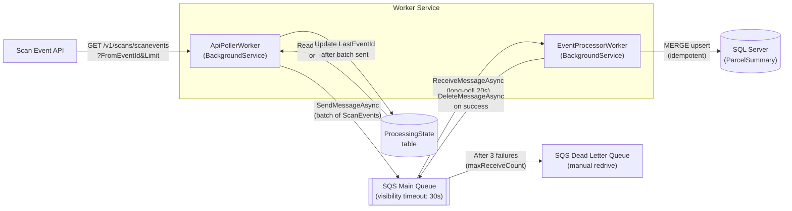
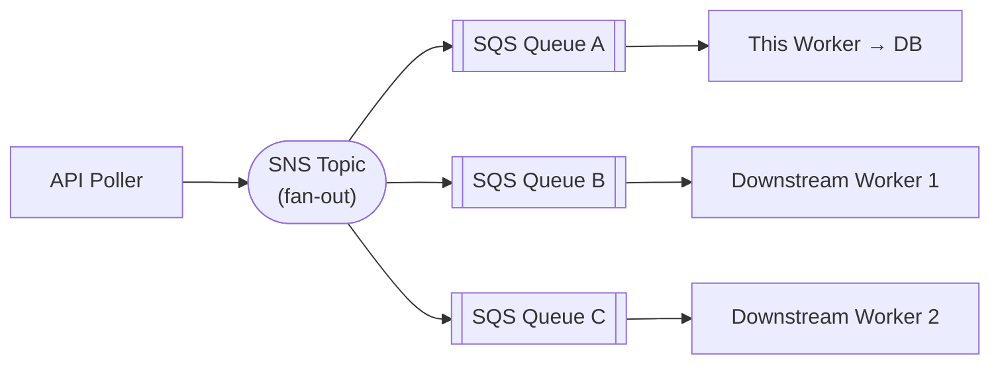

# ScanEventWorker

A .NET 10 worker service that continuously polls a scan event API, queues events through Amazon SQS, and persists parcel summary data to SQL Server. Built for the Freightways take-home exercise.

## Architecture



**Two decoupled `BackgroundService` workers:**

- **`ApiPollerWorker`** — Reads `LastEventId` from `ProcessingState` on startup, polls the API in batches, sends valid events to SQS, and advances `LastEventId` after each successful batch. Resumes from the last processed event on restart.
- **`EventProcessorWorker`** — Long-polls SQS, MERGEs each event into `ParcelSummary`, then deletes the message. On failure the message is not deleted — SQS redelivers after the visibility timeout and moves it to the DLQ after 3 attempts.

## Prerequisites

- [.NET 10 SDK](https://dotnet.microsoft.com/download)
- [Docker](https://www.docker.com/) (for SQL Server + LocalStack)

## Local Setup

### 1. Start infrastructure

```bash
docker-compose up -d
```

This starts:

- **Azure SQL Edge** on `localhost:1433` (ARM64-compatible SQL Server)
- **LocalStack** on `localhost:4566` (local SQS emulator — queues auto-created via `scripts/init-localstack.sh`)

### 2. Create the database

```bash
docker exec -it $(docker ps -q -f ancestor=mcr.microsoft.com/azure-sql-edge) \
  /opt/mssql-tools/bin/sqlcmd -S localhost -U sa -P 'YourStr0ngPassw0rd!' \
  -Q "CREATE DATABASE ScanEvents"
```

The worker auto-creates the `ProcessingState` and `ParcelSummary` tables on startup via `DatabaseInitializer`.

### 3. Set dummy AWS credentials (LocalStack doesn't validate them)

```bash
export AWS_ACCESS_KEY_ID=test
export AWS_SECRET_ACCESS_KEY=test
```

### 4. Configure the API base URL (required)

The worker cannot connect without this. Set it via user-secrets:

```bash
dotnet user-secrets set "ScanEventApi:BaseUrl" "https://your-api-host" \
  --project src/ScanEventWorker
```

Or edit `ScanEventApi:BaseUrl` directly in `src/ScanEventWorker/appsettings.json`.

### 5. Run the worker

```bash
dotnet run --project src/ScanEventWorker/ScanEventWorker.csproj
```

### 6. Verify resumability

Stop the worker (`Ctrl+C`) and restart it. The log will show:

```
Resuming from LastEventId=<n>
```

confirming it picks up from where it left off.

## Running Tests

```bash
dotnet test
```

33 unit tests covering domain behaviour, API client parsing/validation, processor logic, and both BackgroundService workers (`ApiPollerWorker`, `EventProcessorWorker`).

## Building

```bash
dotnet build          # Debug build
dotnet publish -c Release  # Native AOT binary
```

## External Dependencies

| Dependency  | Purpose                                       |
| ----------- | --------------------------------------------- |
| Docker      | Runs SQL Server (Azure SQL Edge) + LocalStack |
| .NET 10 SDK | Build and run the solution                    |

Everything else (NuGet packages, SQS queues, DB schema) is self-contained.

---

## Assumptions

- Events are returned ordered by `EventId` ascending
- `EventId` is monotonically increasing — querying `FromEventId=X` reliably returns all events with ID ≥ X
- The API returns an empty `ScanEvents` array when no more events exist (end-of-feed signal)
- Only one worker instance runs at a time (no distributed locking required)
- `RunId` comes from the nested `User.RunId` field in the JSON response
- `StatusCode` may be an empty string
- `PickedUpAtUtc` and `DeliveredAtUtc` are set on the **first** occurrence of their respective event types and are never overwritten by later events of the same type
- Unknown `Type` values are stored as-is in `ParcelSummary` without setting pickup/delivery timestamps

## Potential Improvements

- **Health checks** — expose `/healthz` endpoint reporting queue depth and DB connectivity
- **Metrics** — OpenTelemetry counters for events processed/sec, SQS queue depth, DLQ size
- **Horizontal scaling** — run multiple `EventProcessorWorker` instances; SQS competing-consumer model handles this without coordination
- **DLQ visibility** — persist DLQ messages to a `FailedEvents` DB table for operational queries
- **Rate limiting** — token bucket on the API poller to avoid hammering the upstream service
- **Database migrations** — replace the `IF NOT EXISTS` initializer with FluentMigrator for versioned schema changes
- **Production database** — RDS SQL Server (added to CDK stack) instead of Docker for managed backups and HA

## Downstream Workers Architecture

The current design is ready for fan-out without changes to this worker. Adding an SNS topic makes the event stream available to any number of downstream consumers:



**Alternatives considered:**

- **Outbox pattern** — write events to an outbox table, dedicated publisher reads and publishes to SNS/SQS. Stronger consistency guarantee but adds DB coupling and latency.
- **CDC (Change Data Capture)** — enable SQL Server CDC on `ParcelSummary`, stream changes via Kafka Connect. Best for consumers that need the DB state, not the raw events.

## CDK Infrastructure

The `src/ScanEventWorker.Cdk` project defines the AWS infrastructure for production deployment:

```bash
cd src/ScanEventWorker.Cdk
cdk deploy
```

Provisions:

- `scan-events-queue` — main SQS queue (visibility timeout: 30s)
- `scan-events-dlq` — dead letter queue with `maxReceiveCount=3` redrive policy

> **Local development:** queues are created automatically by LocalStack when you run `docker-compose up` (via `scripts/init-localstack.sh`). You do not need to run `cdk deploy` locally.

## Design Rationale

This section documents the architectural decisions and patterns in the codebase, with particular attention to where DDD and FP principles were applied deliberately.

### Rich Domain Model

`ParcelSummary` is not a data bag. Its `ApplyScanEvent()` method encapsulates three business rules in one place: idempotency (events with `EventId <= LatestEventId` are silently ignored, making the MERGE-based persistence safe for at-least-once SQS delivery), first-occurrence timestamp protection (`PickedUpAtUtc ??= ...` and `DeliveredAtUtc ??= ...` ensure a later pickup event after delivery never overwrites the original), and event-type semantics (the `switch` on `ScanEventTypes` is the sole location in the codebase that interprets what an event type means). `ScanEventProcessor` is deliberately thin: it delegates business rules to the domain object and wraps infrastructure errors in `Result<T>`.

### Railway-Oriented Error Handling

`Result<T>` is a `readonly struct` with `Success`/`Failure` factory methods and a `Match()` combinator. It is used at every infrastructure boundary: `IScanEventApiClient.GetScanEventsAsync` returns parse and HTTP failures as values rather than throwing; `IScanEventProcessor.ProcessSingleAsync` wraps database errors without propagating them; `ScanEventProcessor.ProcessBatchAsync` processes each event independently so one failure does not abort the batch. Exceptions are reserved for genuinely unrecoverable failures such as missing configuration on startup.

### Decoupled Workers via SQS

`ApiPollerWorker` and `EventProcessorWorker` communicate exclusively through SQS, which provides several properties the design relies on. Fault isolation: a database outage halts `EventProcessorWorker` without affecting `ApiPollerWorker`; events accumulate in the queue and drain automatically on recovery. At-least-once delivery: SQS redelivers unacknowledged messages after the visibility timeout, and the idempotent MERGE in `ApplyScanEvent()` makes redelivery safe. Dead-letter handling: after three failed attempts, SQS moves messages to the DLQ for manual inspection with no bespoke retry logic required. Independent scaling: multiple `EventProcessorWorker` instances can compete for messages without coordination.

### Contracts Over Concretions

All cross-cutting dependencies are defined as interfaces in `ScanEventWorker.Contracts`: `IScanEventApiClient`, `IScanEventRepository`, `IMessageQueue`, and `IScanEventProcessor`. The boundaries are chosen at architectural seams, not merely for test convenience. `IMessageQueue` hides the SQS SDK behind a three-method surface; `IScanEventProcessor` separates orchestration (the worker) from business logic (the processor). This lets the BackgroundService tests use NSubstitute mocks with zero real infrastructure.

### AOT as a Design Constraint

Native AOT (`PublishAot=true`) prohibits runtime reflection, which shaped several decisions. JSON serialization uses `[JsonSerializable]` source-gen contexts rather than `JsonSerializer` with runtime type discovery. Data access uses Dapper.AOT with the `[DapperAot]` attribute and interceptor-based source generation instead of EF Core. Value objects (`EventId`, `ParcelId`) are `readonly record struct` types: zero heap allocation, comparable by value, and fully AOT-safe. The constraint made the codebase more explicit at the cost of additional boilerplate, but also eliminated whole categories of runtime surprises.
