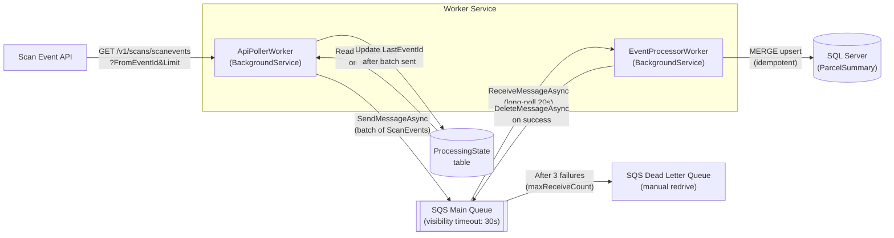

# ScanEventWorker

A .NET 10 worker service that continuously polls a scan event API, queues events through Amazon SQS, and persists parcel summary data to SQL Server. Built for the Freightways take-home exercise.

## Architecture



**Two decoupled `BackgroundService` workers:**

- **`ApiPollerWorker`** — Reads `LastEventId` from `ProcessingState` on startup, polls the API in batches, sends valid events to SQS, and advances `LastEventId` after each successful batch. Resumes from the last processed event on restart.
- **`EventProcessorWorker`** — Long-polls SQS, MERGEs each event into `ParcelSummary`, then deletes the message. On failure the message is not deleted — SQS redelivers after the visibility timeout and moves it to the DLQ after 3 attempts.

## Prerequisites

- [.NET 10 SDK](https://dotnet.microsoft.com/download)
- [Docker](https://www.docker.com/) (for SQL Server + LocalStack)

## Quick Start

See **[docs/local-setup.md](docs/local-setup.md)** for the full setup walkthrough. In brief:

```bash
docker-compose up -d
dotnet user-secrets set "ScanEventApi:BaseUrl" "https://your-api-host" --project src/ScanEventWorker
dotnet run --project src/ScanEventWorker/ScanEventWorker.csproj
```

## Running Tests

```bash
dotnet test
```

33 unit tests covering domain behaviour, API client parsing/validation, processor logic, and both BackgroundService workers (`ApiPollerWorker`, `EventProcessorWorker`).

## Building

```bash
dotnet build          # Debug build
dotnet publish -c Release  # Native AOT binary
```

## External Dependencies

| Dependency  | Purpose                                       |
| ----------- | --------------------------------------------- |
| Docker      | Runs SQL Server (Azure SQL Edge) + LocalStack |
| .NET 10 SDK | Build and run the solution                    |

Everything else (NuGet packages, SQS queues, DB schema) is self-contained.

---

## Assumptions

1. Events are returned ordered by `EventId` ascending
2. `EventId` is monotonically increasing — querying `FromEventId=X` reliably returns all events with ID ≥ X
3. The API returns an empty `ScanEvents` array when no more events exist (end-of-feed signal)
4. Only one worker instance runs at a time (no distributed locking required)
5. `RunId` comes from the nested `User.RunId` field in the JSON response
6. `StatusCode` may be an empty string
7. `PickedUpAtUtc` and `DeliveredAtUtc` are set on the **first** occurrence of their respective event types and are never overwritten by later events of the same type
8. Unknown `Type` values are stored as-is in `ParcelSummary` without setting pickup/delivery timestamps

## Potential Improvements

- [ ] **Health checks**: expose `/healthz` endpoint reporting queue depth and DB connectivity
- [ ] **Metrics**: OpenTelemetry counters for events processed/sec, SQS queue depth, DLQ size
- [ ] **Horizontal scaling**: run multiple `EventProcessorWorker` instances; SQS competing-consumer model handles this without coordination
- [ ] **DLQ visibility**: persist DLQ messages to a `FailedEvents` DB table for operational queries
- [ ] **Rate limiting**: token bucket on the API poller to avoid hammering the upstream service
- [ ] **Database migrations**: replace the `IF NOT EXISTS` initialiser with FluentMigrator for versioned schema changes
- [ ] **Production database**: RDS SQL Server (managed via CDK stack) instead of Docker for managed backups and HA

---

## Further Reading

- [Local Setup](docs/local-setup.md) — Docker, database, credentials, and run steps
- [Infrastructure](docs/infrastructure.md) — CDK stack and downstream fan-out architecture
- [Design Rationale](docs/design-rationale.md) — Domain model, error handling, and AOT decisions
