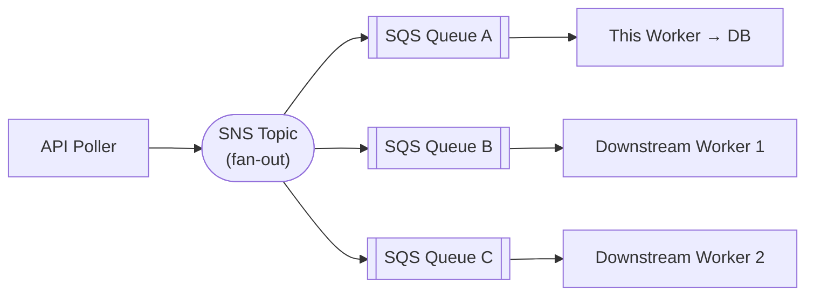

# Infrastructure

## CDK Stack

The `src/ScanEventWorker.Cdk` project defines the AWS infrastructure for production deployment:

```bash
cd src/ScanEventWorker.Cdk
cdk deploy
```

Provisions:

- `scan-events-queue` — main SQS queue (visibility timeout: 30s)
- `scan-events-dlq` — dead letter queue with `maxReceiveCount=3` redrive policy

> **Local development:** queues are created automatically by LocalStack when you run `docker-compose up` (via `scripts/init-localstack.sh`). You do not need to run `cdk deploy` locally.

## Downstream Workers Architecture

The current design is ready for fan-out without changes to this worker. Adding an SNS topic makes the event stream available to any number of downstream consumers:



**Alternatives considered:**

- **Outbox pattern** — write events to an outbox table, dedicated publisher reads and publishes to SNS/SQS. Stronger consistency guarantee but adds DB coupling and latency.
- **CDC (Change Data Capture)** — enable SQL Server CDC on `ParcelSummary`, stream changes via Kafka Connect. Best for consumers that need the DB state, not the raw events.

---

## Spec Constraint: Why Polling Exists

The entire `ApiPollerWorker` exists solely because the spec defines a **pull-only GET endpoint**. This is the root architectural constraint, and it has a cascading effect on every design decision in this codebase.

### What Polling Costs

| Property            | Polling (current)                               | Event-driven (ideal)                |
| ------------------- | ----------------------------------------------- | ----------------------------------- |
| Scaling             | Single-instance (shared `LastEventId` cursor)   | Stateless consumers — scale to zero |
| Latency             | Up to `PollingIntervalSeconds` (5 s)            | Sub-second                          |
| Fan-out             | Requires this worker to forward to SNS/SQS      | Native via EventBridge rules        |
| Fault model         | Long-running process; crash = gap until restart | Lambda retries per-invocation       |
| Infrastructure cost | Always-on ECS/EC2 task                          | Pay-per-invocation                  |
| Operational burden  | Cursor state in SQL, DLQ monitoring             | Managed by the platform             |

Polling is a workaround, not a design choice. If the upstream offered a push mechanism, `ApiPollerWorker`, `ProcessingState`, and `SqsMessageQueue` could all be deleted.

### The Unconstrained Design

If the scan event source could emit events (webhook, DynamoDB Streams, EventBridge, or S3 notifications), the architecture collapses into a fully serverless, event-driven pipeline:

```mermaid
architecture-beta
    service source(internet)[Scan Event Source]

    group aws(logos:aws)[AWS]

    service eb(logos:aws-eventbridge)[EventBridge or SNS] in aws
    service sfn(logos:aws-stepfunctions)[Step Functions] in aws
    service fn(logos:aws-lambda)[Lambda durable functions] in aws
    service db(logos:aws-dynamodb)[DynamoDB] in aws
    service s3(logos:aws-s3)[S3] in aws

    source:R --> L:eb
    eb:R --> L:sfn
    sfn:T --> T:fn
    eb:B --> T:fn
    sfn:R --> L:db
    sfn:B --> T:s3
```



**Each component earns its place:**

- **EventBridge / SNS** — zero-config fan-out; downstream consumers subscribe without any changes to the producer
- **AWS Step Functions** — replaces `EventProcessorWorker`'s manual retry/DLQ logic with durable, visual orchestration; retries, catch blocks, and compensating transactions are declared, not coded
- **DynamoDB** — replaces SQL Server with a serverless, horizontally scaled store; DynamoDB Streams can trigger further Lambdas for free, enabling second-order fan-out with no extra infrastructure
- **S3** — each raw event lands in an S3 object on arrival; satisfies compliance audit requirements without any schema migration
- **Lambda** — each invocation is independent; a crash affects one event, not the entire feed; cold-start latency is acceptable at 5-second polling granularity anyway

### Why This Matters for Microservices

The polling model creates a centralised bottleneck: exactly one process owns the cursor, owns the queue writes, and owns the fan-out decision. In a microservices context this is an anti-pattern — every downstream team depends on this worker staying healthy.

An event-driven source eliminates the coupling entirely. Downstream services subscribe to EventBridge or SNS directly; the scan event producer has no knowledge of consumers, and neither does this worker.

The current SQS abstraction (`IMessageQueue`) was designed with this migration in mind: replacing `SqsMessageQueue` with an EventBridge publisher requires changing one DI registration in `Program.cs`.
